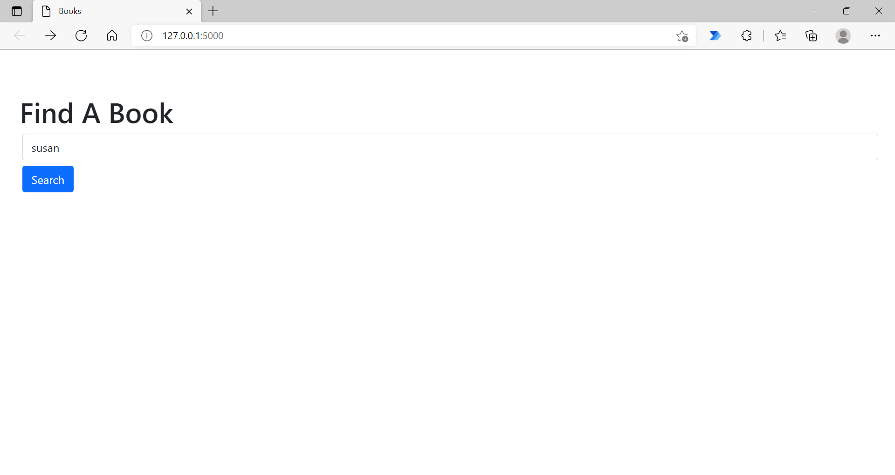
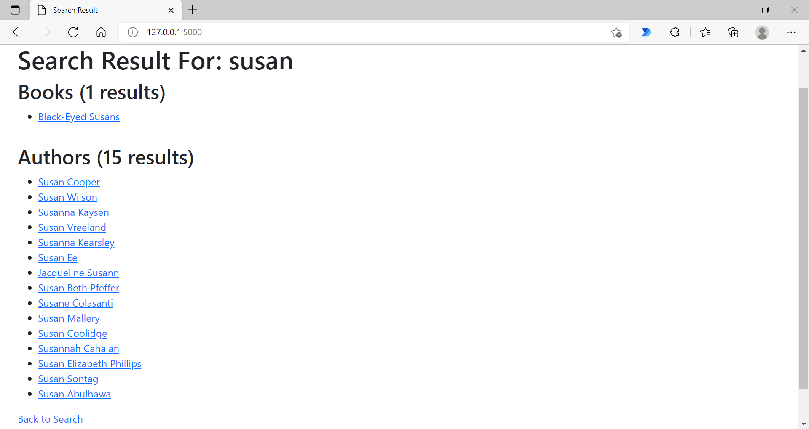
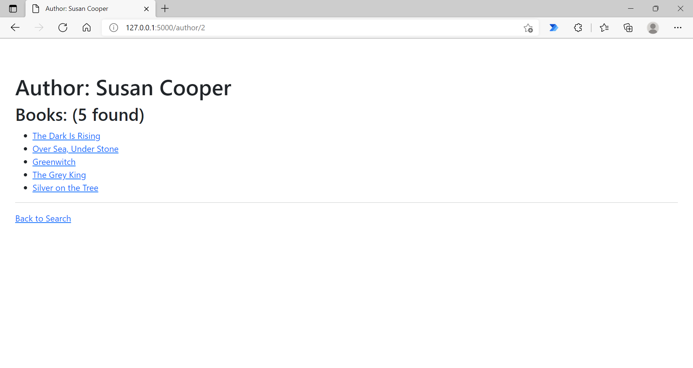
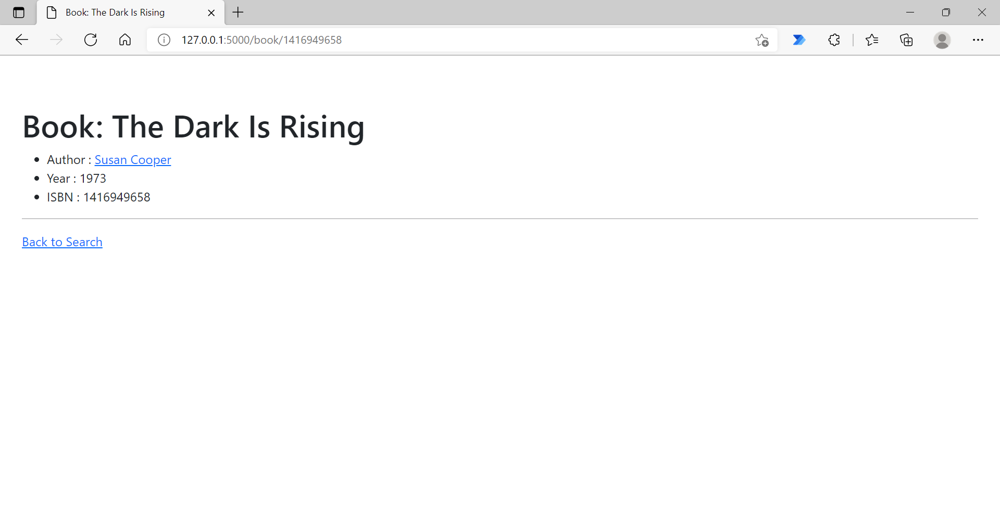

# CS50 Beyond 2019: Books

[Web App Link](https://cs50beyond-2019-books.herokuapp.com/)

## Table of Contents

- [CS50 Beyond 2019: Books](#cs50-beyond-2019-books)
  - [Table of Contents](#table-of-contents)
  - [Requirements](#requirements)
  - [Technologies Used](#technologies-used)
  - [Project Structure](#project-structure)
  - [Features](#features)
  - [Snapshots](#snapshots)
    - [1. Landing Page/Search Page](#1-landing-pagesearch-page)
    - [2. Search Result Page](#2-search-result-page)
    - [3. Author Page](#3-author-page)
    - [4. Book Page](#4-book-page)
  - [References](#references)

## Requirements

- Importing books database into PostgreSQL
- Build a web application that:
  - Let users search for books by (partial) title and/or author
  - Links to pages for individual books
  - Links to pages for individual authors

## Technologies Used

- Flask
- Gunicorn
- Heroku
- PostgreSQL

## Project Structure

| File/Directory    | Description                                   |
|-------------------|-----------------------------------------------|
| `app.py`          | Flask web app                                 |
| `create.py`       | Create database tables based on `models.py`   |
| `import.py`       | Import books dataset into database            |
| `delete.py`       | Drop all tables in database                   |
| `models.py`       | Define database table schemas based on ORM    |
| `static/`         | Contain CSS file and favicon                  |
| `templates/`      | Contain HTML templates for web page           |
| `Procfile`        | Heroku deployment                             |
| `books.csv`       | Contain books dataset                         |

## Features

- Search a book by partial title or author
- Display relevant search results in 2 categories (Book & Author)
- Show number of search results for each category
- Author Page displays name and all the books written by the author
- Book Page displays title, year and ISBN as well as the book author

## Snapshots

### 1. Landing Page/Search Page

### 2. Search Result Page

### 3. Author Page

### 4. Book Page

## References

- [https://stackoverflow.com/questions/24522290/cannot-catch-sqlalchemy-integrityerror](https://stackoverflow.com/questions/24522290/cannot-catch-sqlalchemy-integrityerror)

- [https://stackoverflow.com/questions/24289808/drop-all-freezes-in-flask-with-sqlalchemy](https://stackoverflow.com/questions/24289808/drop-all-freezes-in-flask-with-sqlalchemy)
